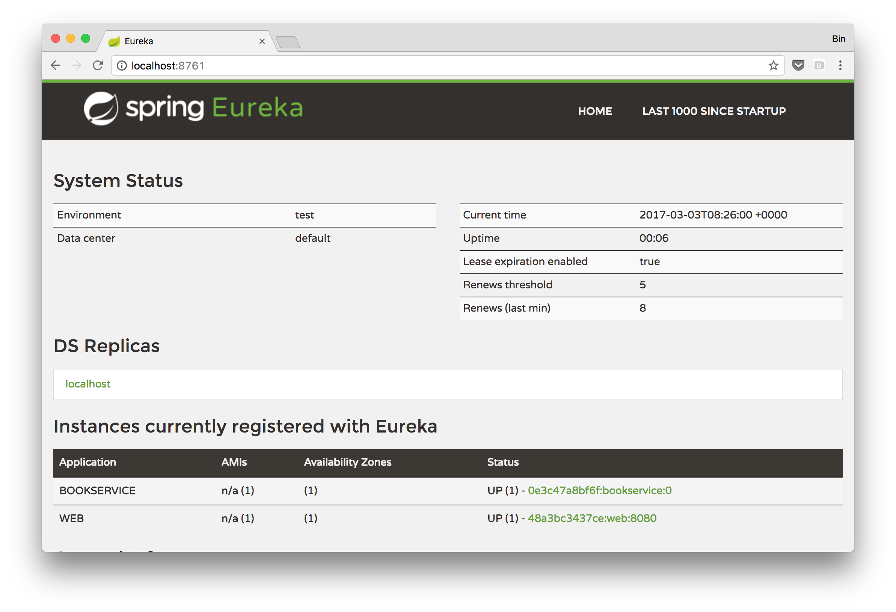

# Spring Cloud Demo on Docker


# Spring Cloud application

Demo application is a tiny Spring Cloud application which has three services. ```Web``` and ```BookService```will register itself to ```Eureka``` Service during boot. ```Web``` service depends on ```BookService```, when it is invoked, it will find available instances of ```BookService``` from ```Eureka``` Server and get input. 


## Build


Run this command to build all images.

```
./build-all.sh
```


## Run


```
cd compose
docker-compose -f springcloud-demo.yml up -d
```


Find which port to which port

```
$ docker-compose -f springcloud-demo.yaml ps
        Name                       Command               State            Ports
----------------------------------------------------------------------------------------
compose_bookservice_1   java -Djava.security.egd=f ...   Up
compose_eureka_1        java -Djava.security.egd=f ...   Up      0.0.0.0:8761->8761/tcp
compose_web_1           java -Djava.security.egd=f ...   Up      0.0.0.0:32771->8080/tcp
```


## Access Eureka Server

```
http://localhost:8761
```




You will see that there are two services registered to eureka server: ```web``` and ```bookservice```. ```web``` will invoke ```bookservice``` when it is accessed.


## Access the demo application

```
http://localhost:8080
```


## Deploy to docker swarm using compose V3 template


[compose/springcloud-demo.yml](compose/springcloud-demo.yml)

```yaml
version: '3'
services:
  eureka:
    image: binblee/demo-eurekaserver
    ports:
      - "8761:8761"
    labels:
      - "aliyun.logs.eureka=stdout"

  web:
    image: binblee/demo-web
    environment:
      - EUREKA_SERVER_ADDRESS=eureka
    ports:
      - "8080"
    labels:
      - "aliyun.logs.web=stdout"

  bookservice:
    image: binblee/demo-bookservice
    environment:
      - EUREKA_SERVER_ADDRESS=eureka
    labels:
      - "aliyun.logs.bookservice=stdout"
```


You can deploy to a docker swarm cluster like this:

```
docker stack deploy -f springcloud-demo.yml springcloud-demo
```


