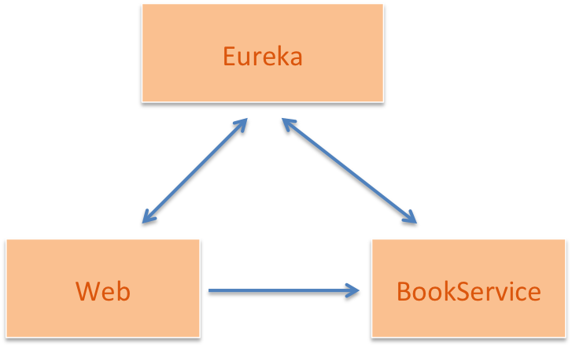
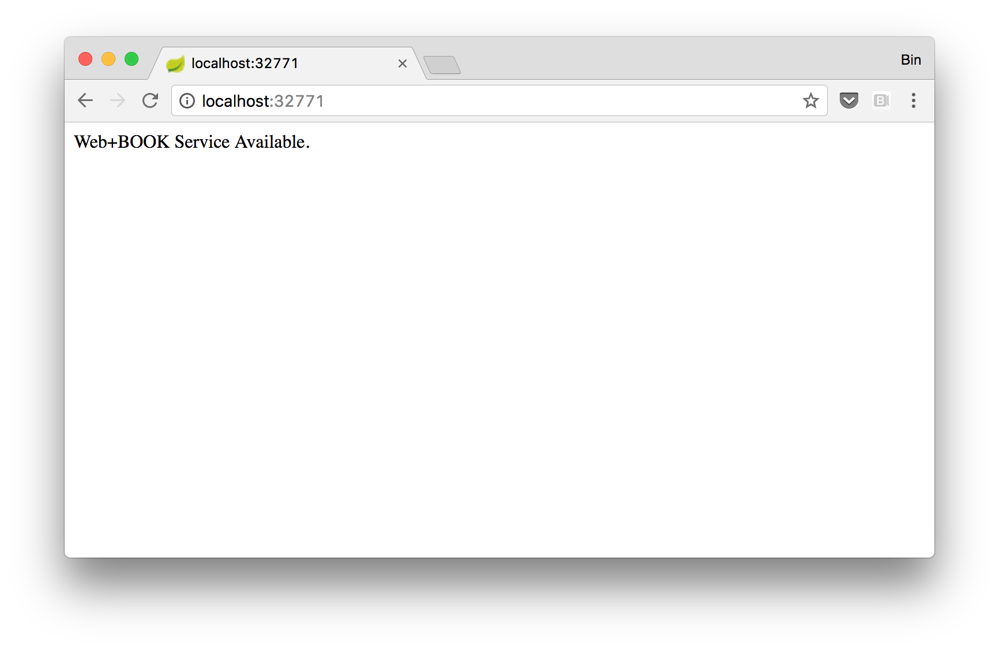

# Docker Swarm运行Spring Cloud应用

Docker Swarm Mode集群和传统的Swarm集群最大的差异是利用引擎内置的集群管理能力，取消了对KVStore依赖，简化了Docker集群的创建和管理。随着Docker商业化产品的步伐加快，其Docker Datacenter也已经支持了Swarm Mode。今天，我们就和大家一起看一下如何利用这些最新特性在Swarm Mode集群中部署一个Spring Cloud应用。本文的示例代码见


## 极简版Spring Cloud应用

云应用（Cloud Native Application）的一个重要特点是动态。运行在云上的应用，其实例可能随时生灭，随着负载的变化，数目也会增减。为适应这个变化，应用需要借助于服务发现来相互定位。开源的微服务框架Spring Cloud中封装了Netflix的服务发现Eureka，一个极简的Spring Cloud应用可以是如下结构：




Web应用在访问时会调用BookService，宣布两个服务都正常。


```
$ curl http://web:8080/
Web+BOOK Service Available.
```


Web对BookService服务调用参见ApplicationController.java代码。


```java
    @RequestMapping("/")
    public String getIndex(){
        String message = restTemplate.getForObject("http://bookservice/",String.class);
        return "Web+" + message;
    }
```


可以看到restTemplate访问```"http://bookservice/"```，从```Eureka```服务中检索到名为```bookservice```服务的所有实例地址和端口号，利用客户端负载机制选择其中一个实例进行访问。


```BookService```服务在启动的时候会自动向```Eureka```注册。Eureka Server的地址配置在```application.properties```文件中：

```
server.port=0
eureka.client.serviceUrl.defaultZone=http://${EUREKA_SERVER_ADDRESS}:8761/eureka/
```


在```bootstrap.properties```文件中声明服务名：

```
spring.application.name=bookservice
```


如果大家查看```Web```服务的相应文件，也会看到类似的配置，只不过声明自己的服务名不同。


Spring Cloud对Eureka Server和Eureka Client做了很好的封装，一个应用只需通过如下标注即可成为Eureka Server：

```java
@SpringBootApplication
@EnableEurekaServer
public class EurekaApplication {
   ...
}
```


Eureka Client的声明如下：

```java
@SpringBootApplication
@EnableDiscoveryClient
public class BookserviceApplication {
   ...
}
```


## 构建镜像

构建镜像分两个步骤，Gradle编译生成Spring Boot JAR；然后利用Dockerfile创建Docker镜像。

```
$ ./gradlew build
$ docker build -t <镜像名>:<标签> .
```


示例Dockerfile是针对Gradle编译出来的目录结构的。如果使用Maven编译，请更改JAR目录位置。

```
FROM java:8-jre-alpine
VOLUME /tmp
ADD build/libs/*.jar app.jar
RUN sh -c 'touch /app.jar'
ENTRYPOINT ["java","-Djava.security.egd=file:/dev/./urandom","-jar","/app.jar"]
```


全部构建完成后查看新生成的Docker镜像：

```
$ docker image ls
REPOSITORY         TAG         IMAGE ID       CREATED      SIZE
demo-web           latest      281e25e4c72c   2 days ago   180 MB
demo-bookservice   latest      249a93dfe3c6   2 days ago   180 MB
demo-eurekaserver  latest      2cfeb50cf373   2 days ago   204 MB
```


## 在本地运行

在compose目录下有一个V3版本的部署描述文件```springcloud-demo.yml```。如果你的计算机上有docker-compose，可以运行如下命令启动全部服务：

```
$ cd compose
$ docker-compose -f springcloud-demo.yml up -d
```


找到Eureka和Web的所对应的端口。

```
$ docker-compose -f springcloud-demo.yaml ps
        Name                       Command               State            Ports
----------------------------------------------------------------------------------------
compose_bookservice_1   java -Djava.security.egd=f ...   Up
compose_eureka_1        java -Djava.security.egd=f ...   Up      0.0.0.0:8761->8761/tcp
compose_web_1           java -Djava.security.egd=f ...   Up      0.0.0.0:32771->8080/tcp
```


访问```Eureka Server```：


从上面的输出可以看到Web和BookService服务各有一个实例注册上了。下面访问```Web```服务：




## 部署到Swarm Mode集群

Docker 1.12开始Swarm Mode集群模式，相关的文章可以参考云栖文章。读者登录到任意Swarm管理节点，执行部署命令。

```
docker stack deploy -f springcloud-demo.yml springcloud-demo
```


示例springcloud-demo.yml采用Compose V3格式，新格式和V2的差别讨论间云栖文章。我们在这里没有使用V3特有的内容，贴在这里供大家参考：

```
version: '3'
services:
  eureka:
    image: XXX/demo-eurekaserver
    ports:
      - "8761:8761"
  web:
    image: XXX/demo-web
    environment:
      - EUREKA_SERVER_ADDRESS=eureka
    ports:
      - "8080"
  bookservice:
    image: XXX/demo-bookservice
    environment:
      - EUREKA_SERVER_ADDRESS=eureka
```


## 部署到Docker Datacenter

Docker公司的商业版集群管理软件Docker Datacenter支持了Swarm Mode模式集群。云栖上有一篇文章可以参考在阿里云上一键部署。


最新的Docker Datacenter 2.1上用户可以通过界面上的Compose编辑器输入Compose模版完成部署，效果和上面用```docker stack```命令一样。


在2.0版上没有Compose模版编辑界面，读者可以登录进入任何一个管理节点，通过命令行执行同样命令部署：

```
docker stack deploy -f springcloud-demo.yml springcloud-demo
```


## 小结

本文讨论了如何在Docker Swarm Mode集群上部署一个Spring Cloud应用，可以看出Docker Swarm的优雅之处在于集群管理和Docker API一致以及优异的开发者体验。阿里云容器服务除了在共有云上提供了CaaS能力能力也会很快支持Swarm Mode，具体内容请移步。