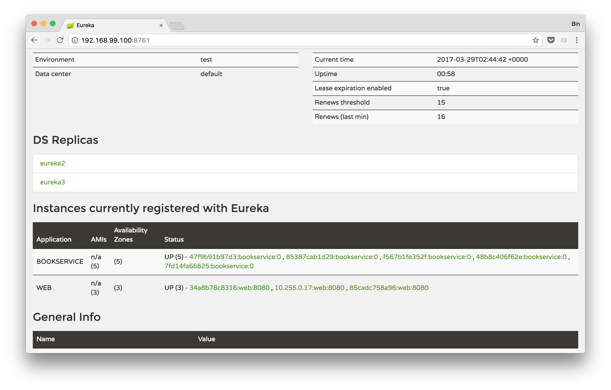

# Docker Swarm运行Spring Cloud（二）：Eureka高可用

> 在上篇文章中介绍了如何如何在Docker Swarm集群中部署Spring Cloud应用。本文章为大家介绍如何实现Eureka的高可用。


## 基础服务独立部署

把所有服务一次性部署好非常方便，但是在生产环境中使用的时候需要考虑这样一些因素：

- 在生产环境中的基础服务，如Eureka由于更新不频繁，应该和频繁更新应用服务分开部署
- 作为基础服务的Eureka需要考虑高可用


我们可以把部署描述文件分成两部分，[eureka.yml](compose/eureka.yml) 用来部署作为基础服务的Eureka Server，是包含三各节点的集群。

[eureka.yml](compose/eureka.yml)

```yaml
version: '3'
services:
  eureka1:
    image: binblee/demo-eurekaserver
    networks:
      springcloud-overlay:
        aliases:
          - eureka
    ports:
      - "8761:8761"
    environment:
      - ADDITIONAL_EUREKA_SERVER_LIST=http://eureka2:8761/eureka/,http://eureka3:8761/eureka/
    ...
  eureka2:
    image: binblee/demo-eurekaserver
    networks:
      springcloud-overlay:
        aliases:
          - eureka
    ports:
      - "8762:8761"
    environment:
      - ADDITIONAL_EUREKA_SERVER_LIST=http://eureka1:8761/eureka/,http://eureka3:8761/eureka/
    ...
  eureka3:
    image: binblee/demo-eurekaserver
    networks:
      springcloud-overlay:
        aliases:
          - eureka
    ports:
      - "8763:8761"
    environment:
      - ADDITIONAL_EUREKA_SERVER_LIST=http://eureka1:8761/eureka/,http://eureka3:8761/eureka/
    ...
networks:
  springcloud-overlay:
    external:
      name: springcloud-overlay
```


Eureka部署到的网络```springcloud-overlay```需要手动创建，命令如下：

```sh
docker network create -d overlay springcloud-overlay
```


从部署模版中可以看出这三个Eureka实例在网络上的别名(alias)都是```eureka```，对于客户端可以在配置文件中指定这个别名即可，不必指定三个示例的名字。

[application.yml](web/src/main/resources/application.properties)

```yaml
eureka.client.serviceUrl.defaultZone=http://${EUREKA_SERVER_ADDRESS}:8761/eureka/
```


Eureka Server的地址通过```${EUREKA_SERVER_ADDRESS}``` 环境变量传入。


```yaml
services:
  web:
    image: binblee/demo-web
    ...
    environment:
      - EUREKA_SERVER_ADDRESS=eureka
```


另外要注意的是所有依赖于Eureka的应用服务都要挂到```springcloud-overlay```网络上，否则无法和Eureka Server通信。下面是比较完整的部署描述文件的示例：

```yaml
version: '3'
services:
  web:
    image: binblee/demo-web
    networks:
      - springcloud-overlay
    environment:
      - EUREKA_SERVER_ADDRESS=eureka
    ports:
      - "8080"
    ...

  bookservice:
    image: binblee/demo-bookservice
    networks:
      - springcloud-overlay
    environment:
      - EUREKA_SERVER_ADDRESS=eureka
    ...

networks:
  springcloud-overlay:
    external:
      name: springcloud-overlay
```


部署这几个服务需要3个步骤，首先创建overlay网络，然后部署Eureka，最后再部署应用服务。命令如下：


```sh
docker network create -d overlay springcloud-overlay
cd compose/
docker stack deploy -c eureka.yml
docker stack deploy -c demoweb.yml
```


访问Swarm集群中的任意节点的8761端口，可以看到Eureka实例1有两个副本，eureka2和eureka3，2个应用服务已经注册上去了。访问8762和8763，可以看到另外两个Eureka的管理界面，内容类似。



## 小结

本文章为大家介绍如何在Docker swarm-mode集群部署一个Eureka集群，并配置应用服务访问Eureka。通过这样的方式可以很方便地做到基础服务和应用分开部署，并且可以保证了基础服务的高可用。